# Controlador PID Analógico: Diseño, Simulación e Implementación

Este repositorio contiene el desarrollo integral de un controlador PID analógico, desde el modelado teórico y la simulación hasta el diseño de PCB y la validación en hardware real.
---

  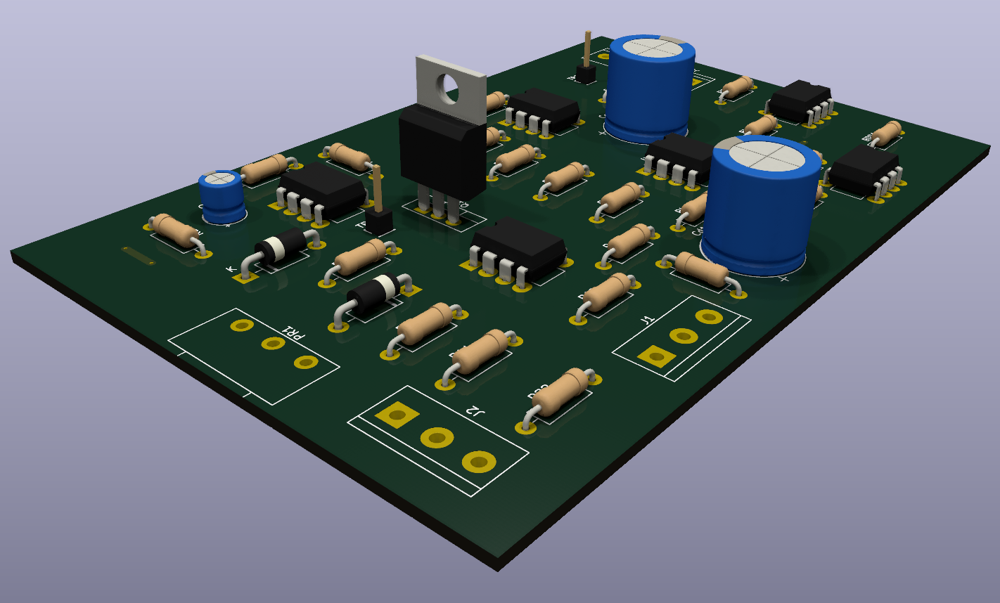

---

## 📋 Características Técnicas
* **Topología:** Controlador PID Analógico.
* **Software de Diseño:** KiCad (v9.0.7).
* **Simulación:** LTspice (v26.0.1).
* **Diseño de PCB:** Single-layer con plano de masa (GND).
* **Documentación:** Informe técnico completo incluido en la carpeta `/docs`.

---

## 📈 Simulación en LTspice
Antes del diseño físico, se validó la respuesta temporal del controlador utilizando **LTspice**. El objetivo fue ajustar las constantes para minimizar el *overshoot* y optimizar el tiempo de establecimiento ($t_s$).

$$u(t) = K_p e(t) + K_i \int_{0}^{t} e(\tau) d\tau + K_d \frac{de(t)}{dt}$$

| Controlador PID | Respuesta al Escalón |
| :---: | :---: |
| 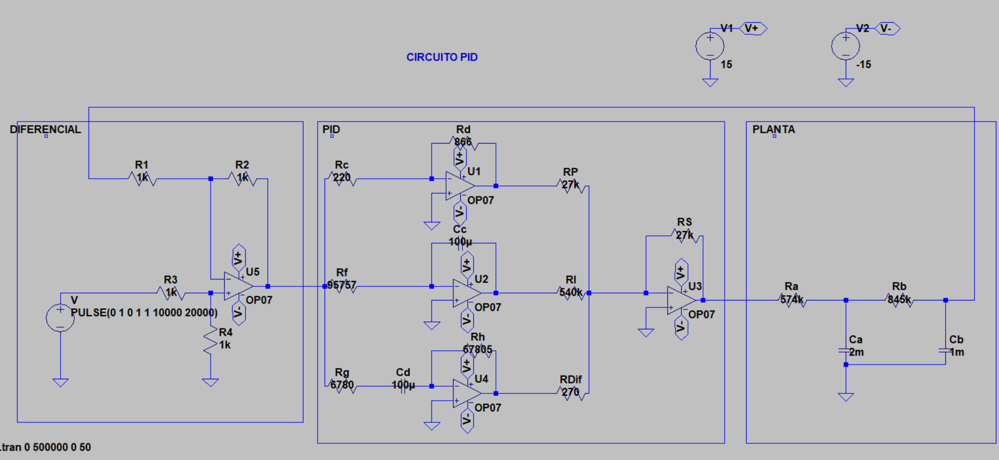 | 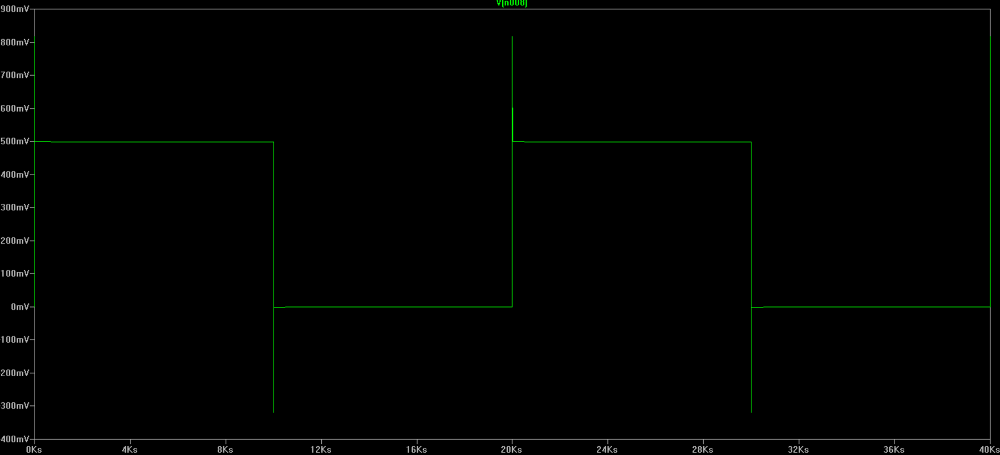 |

> **Nota:** Los archivos de simulación (`.asc`) están disponibles en la carpeta `/simulation` para su replicación.

---

## 🎨 Diseño de Hardware (KiCad)
El diseño del PCB se optimizó para facilitar el prototipado rápido y garantizar la integridad de la señal frente a ruidos e interferencias.

### Esquemático (Hoja Raíz)
Se utilizó un diseño jerárquico para separar las etapas de adquisición, procesamiento de error y potencia.

  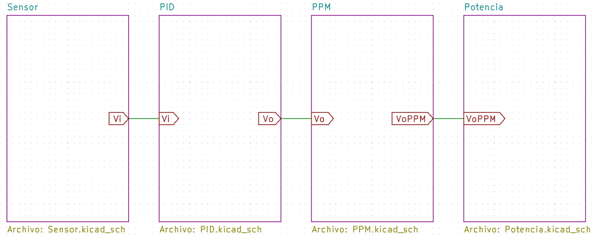

| Sensor | PID |
| :---: | :---: |
| 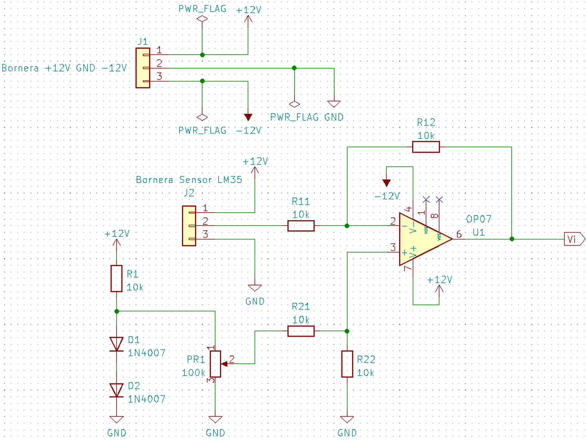 | 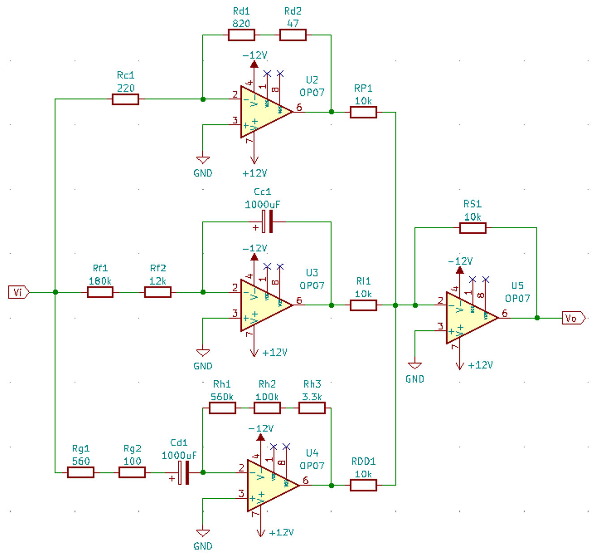 |

| PPM | Potencia |
| :---: | :---: |
| 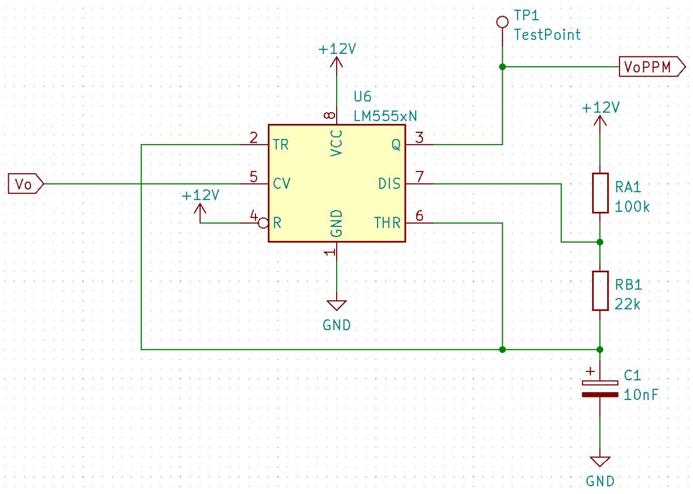 | 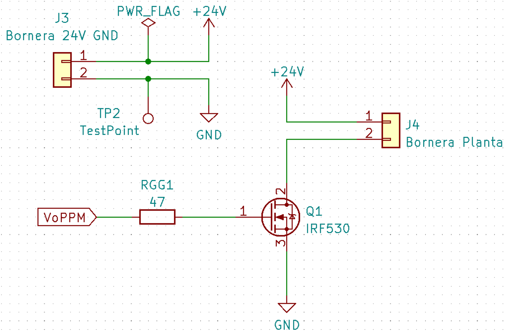 |

### Layout y Ruteado
* **Integridad de Señal:** Se implementó un plano de masa (**Copper Pour**) para reducir la impedancia de retorno.
* **Single-Layer:** El ruteado se realizó exclusivamente en la capa inferior (**Back Copper**) para simplificar la manufactura manual.

| Ruteado de Pistas (Sin relleno) | Diseño Final (Con Plano de Masa) |
| :---: | :---: |
| 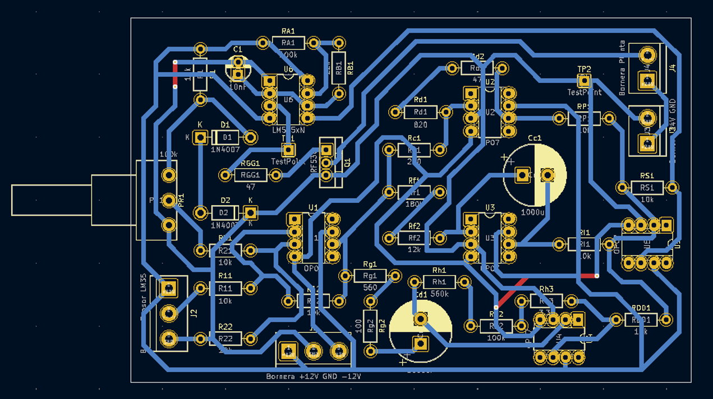 | 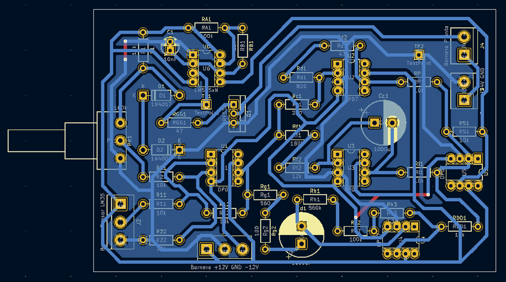 |

| Modelo 3D (Vista Frontal) | Modelo 3D (Vista Posterior) |
| :---: | :---: |
| 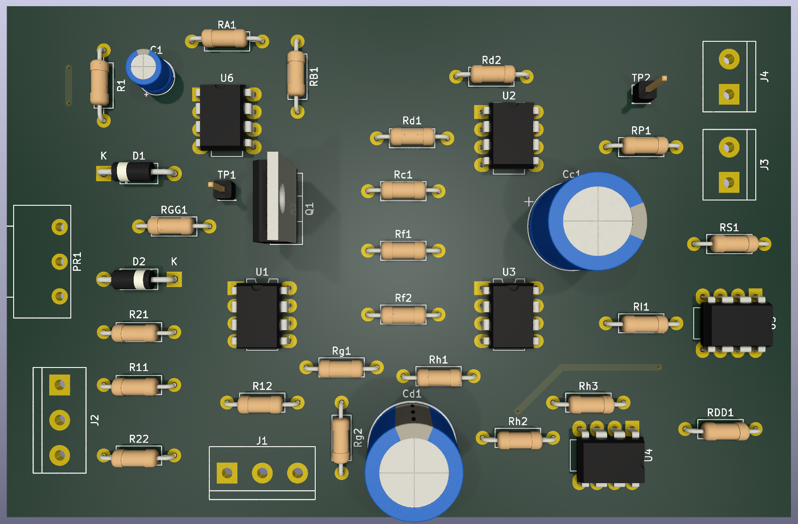 | 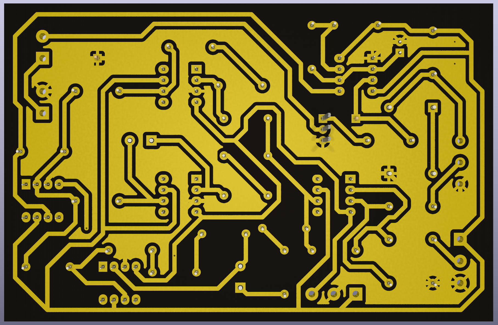 |

---

## 🛠️ Implementación y Resultados Reales
El proyecto concluyó con la fabricación física y la integración con el sensor y la carga, comparando los resultados experimentales con los simulados.

### Montaje y Calidad de Soldadura
| Vista Frontal (Componentes) | Vista Posterior (Soldadura) |
| :---: | :---: |
|  | 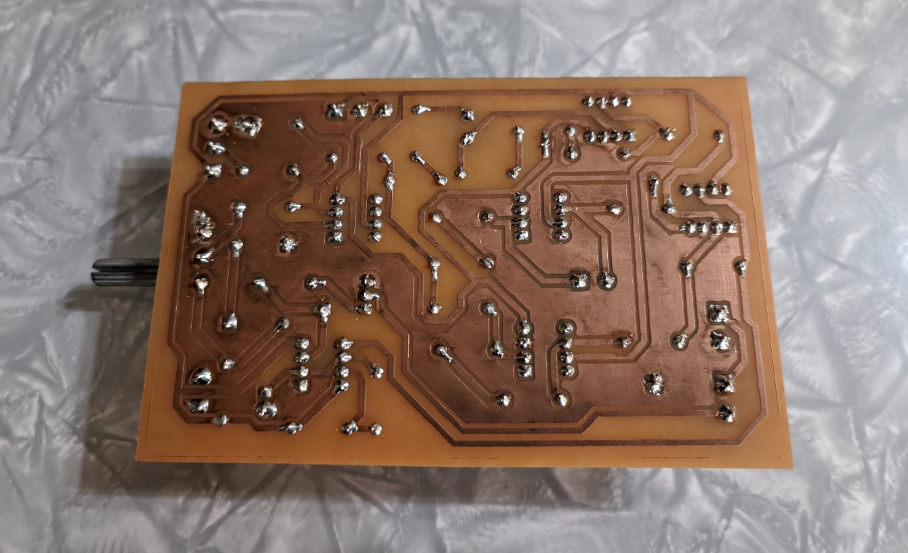 |

### Integración del Sistema
Se validó el lazo cerrado conectando el controlador a la carga (planta térmica) y al sensor de temperatura LM35DZ, verificando la estabilidad del sistema ante perturbaciones.

  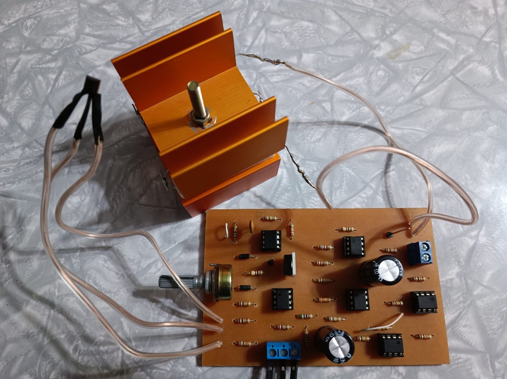

---

## 📂 Estructura del Repositorio
* `/kicad`: Archivos fuente del proyecto (`.kicad_pro`, `.kicad_sch`, `.kicad_pcb`).
* `/simulation`: Archivos de LTspice y capturas de ondas.
* `/img`: Imágenes, renders y capturas utilizadas en este README.
* `/docs`: Informe técnico detallado y lista de materiales (BOM).
* `/manufacturing`: Documentación de manufactura dividida en capas (`gerbers/`) y perforaciones (`drill/`). Incluye un archivo .zip listo para servicios de prototipado rápido.